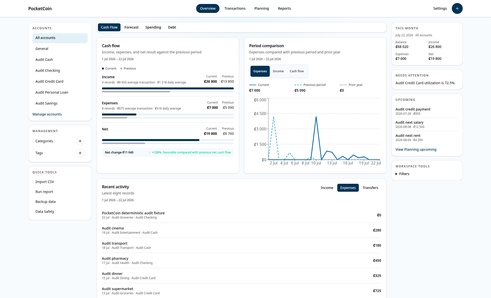
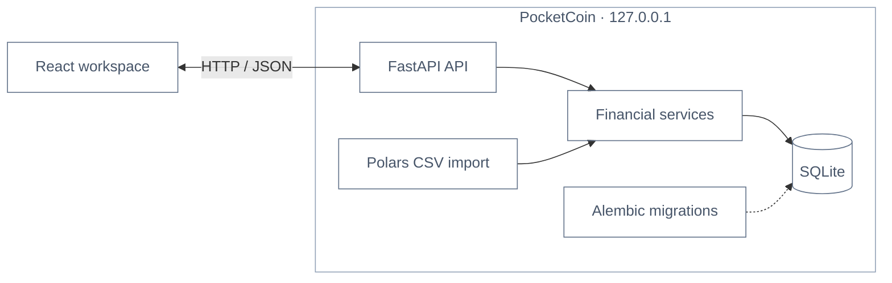

# PocketCoin

PocketCoin is a local-first personal budgeting application. It combines account tracking, transaction management, planning, and financial analysis in a responsive web workspace, with no login or cloud service required.



## Features

- Track cash, checking, savings, credit card, overdraft, and loan accounts, including opening balances and credit limits.
- Record, edit, search, filter, and delete income, expenses, and atomic account transfers.
- Add categories, tags, notes, debt-payment classification, and weekly, monthly, or yearly recurrence to financial activity.
- Review posted activity and upcoming recurring entries together in the transaction timeline.
- Plan monthly category budgets and manage upcoming income, expenses, and debt payments.
- Analyze balances, forecasts, cash flow, period comparisons, category spending, budget progress, credit utilization, recurring debt, and debt-to-income ratio.
- Scope Overview, Transactions, and Reports to all accounts, General activity, or one financial account; Planning stays global while preserving the selected scope.
- Import CSV files through preview, column mapping, validation, duplicate review, and commit steps.
- Export complete or filtered transaction history as spreadsheet-safe CSV.
- Configure currency, locale, first day of week, and light, dark, or system theme.
- Create local backups and perform validated restores from Settings.
- Use the responsive workspace, keyboard-accessible navigation, contextual rails or sheets, and global Quick Add flow from desktop or compact screens.

## Quick start

Prerequisites: Python 3.12+, [uv](https://docs.astral.sh/uv/), Node.js, and npm.

From the repository root, install dependencies, apply migrations, seed reference data, and build the frontend:

```bash
make setup
```

Start the complete application:

```bash
make run
```

Open <http://127.0.0.1:8000>. FastAPI serves both the API and the production React bundle from one local process.

## Local data

PocketCoin stores its SQLite database, temporary imports, and managed backups in `./data` by default. Set `POCKETCOIN_DATA_DIR` to use a different local directory:

```bash
POCKETCOIN_DATA_DIR=/path/to/pocketcoin-data make setup
POCKETCOIN_DATA_DIR=/path/to/pocketcoin-data make run
```

Backups live under `<POCKETCOIN_DATA_DIR>/backups`. Restore is available through **Settings → Data safety**, accepts an existing managed backup, and creates a retained pre-restore backup automatically.

## Architecture



The backend owns financial validation and calculations. The frontend owns presentation, temporary interface state, tables, and Recharts visualizations. Polars handles bounded CSV parsing and transformation. Alembic owns schema migrations.

## Development

Run the development servers in separate terminals:

```bash
make dev-backend
make dev-frontend
```

Validate changes from the repository root:

```bash
make check   # Ruff, ESLint, strict TypeScript checks, pytest, and Vitest
make build   # Production frontend build
```

Additional project commands include `make migrate`, `make seed`, `make test-backend`, and `make test-frontend`.

## License

PocketCoin is licensed under the [MIT License](LICENSE).
